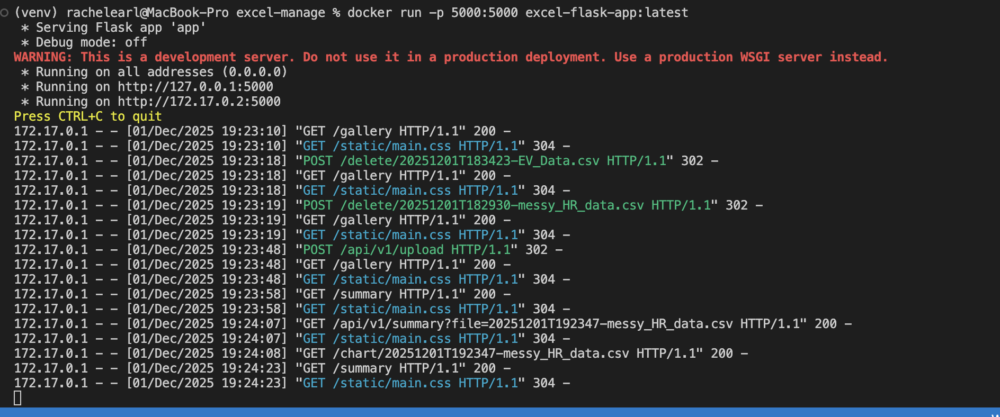
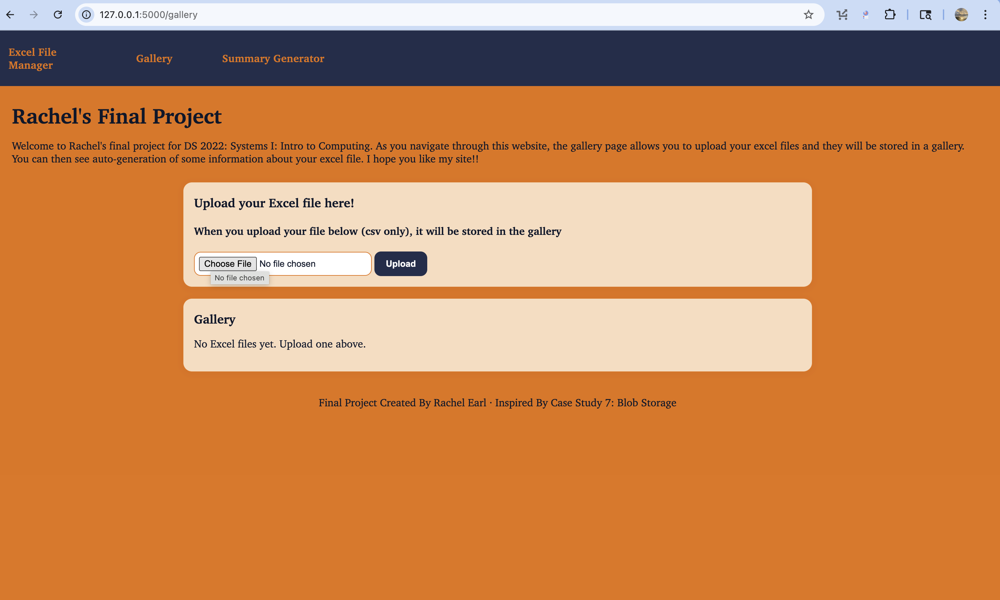
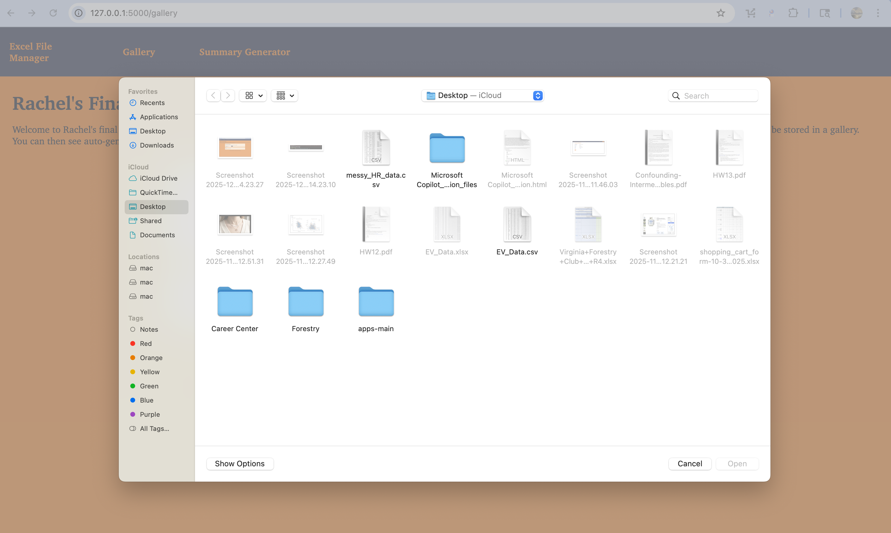
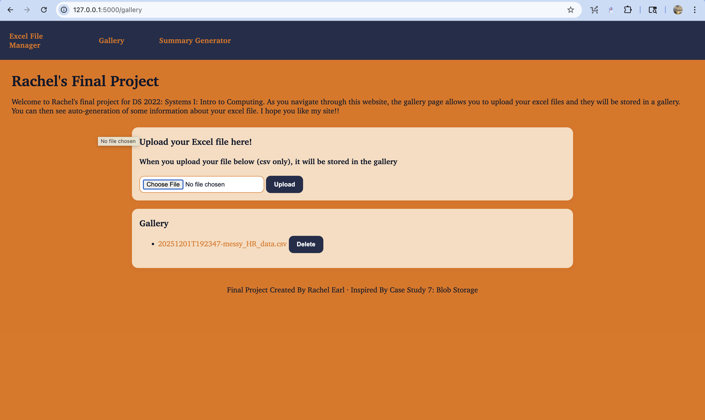
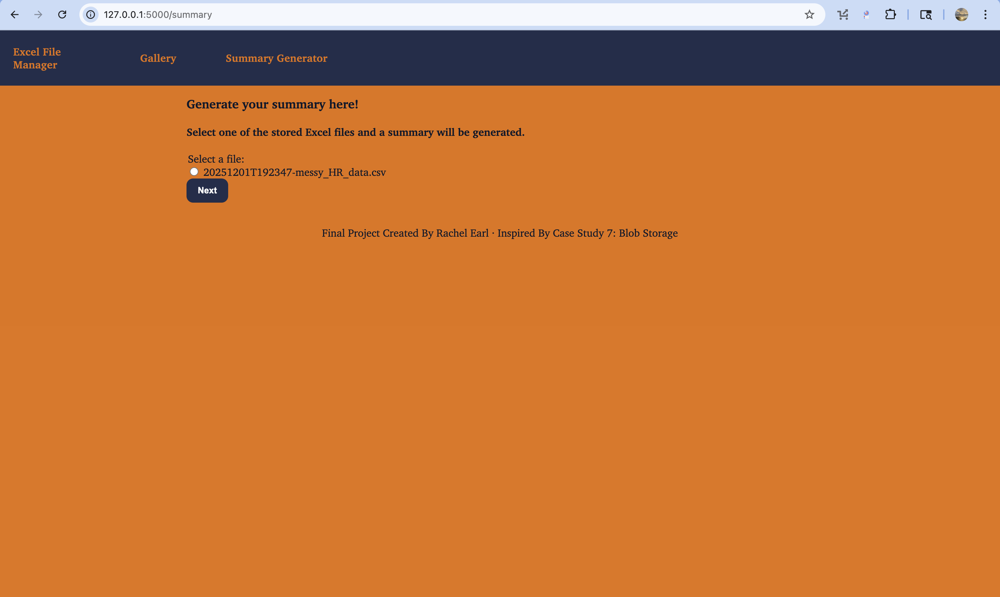
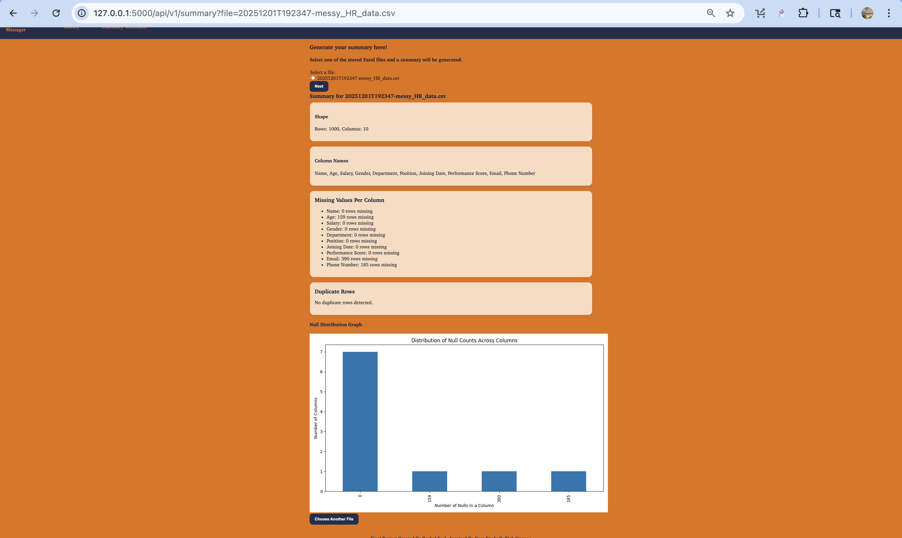

# RE-Final-Project-DS2022

### 1) Executive Summary: <br>
Problem: There are many people that are not familiar with coding, however, need to work with data for their job or are interested in understanding a particular data set. <br>
Solution: In my web app, I allow users to upload their CSV files, store it in a gallery, and see a summary of some information about the data including shape, column names, number of nulls, and number of duplicates. These functions are for users that are not familiar with cleaning data coding and wish to understand how clean their data is. From the summary page, the user can identify quickly if they need to look further into the code if there is an abnormally high number of nulls or duplicates. 

### 2) System Overview Course Concept(s):  <br>
I used Azure's blob storage containers, taught in Case 7, to store the user's uploaded CSV files. These files are stored in the gallery on the gallery page, and are accessed in the summary page when generating a summary of the data. 
Architecture Diagram: Include a PNG in /assets and embed it here.
Data/Models/Services: For my testdata, I used a data set from Kaggle called "Messy-dataset" by user eyowhite (permalink: https://github.com/eyowhite/Messy-dataset/blob/feded56bde2cc1bd72455fc8842866ac3a67090a/messy_HR_data.csv). 
<br>

```text
EXCEL-MANAGE
│
├── app.py 
├── run.sh 
├── Dockerfile  
├── requirements.txt 
├── README.md 
│
├── .env.example  
├── .gitignore
│
├── __pycache__/
│   └── app.cpython-313.pyc
│
├── assets/
│   ├── screenshots/
│   │   ├── docker-running-app.png
│   │   ├── pt1-gallery-page.png
│   │   ├── pt2-click-choose-file.png
│   │   ├── pt3-file-stored-in-assets.png
│   │   ├── pt4-summary-page.png
│   │   └── pt5-summary-generated.png
│   │
│   └── testdata.csv 
│
├── static/
│   └── main.css 
│
├── templates/
│   ├── gallery.html 
│   └── summary.html 
│
└── venv/
    ├── bin/
    ├── include/
    ├── lib/
    └── share/


### 3) How to Run (Local): <br>
I chose to use Docker:


```dockerfile
FROM python:3.11-slim
WORKDIR /app
COPY requirements.txt .
COPY assets .
ENV AZURE_STORAGE_CONNECTION_STRING='PASTE-CONNECTION-STRING-FROM-ENV'
RUN pip install --no-cache-dir -r requirements.txt
COPY . .
EXPOSE 5000
CMD ["python", "app.py"]
```


### 4) Design Decisions: <br>

I chose to format my app.py into two html pages because I believe some users may simply use this webapp as a storage container for their CSV files, whereas other users may want to specifically use the site to evaluate the information of the file. Additionally, having a seperate page for the summary information allows for less clutter because there is so much information generated, leading to less scrolling for the user. <br>

One limitation I set was that users can only upload CSV and xlsx. I did this because this site is only for those types of files. 


### 5) Results & Evaluation <br>
The screenshots in the assests folder demonstrate the flow of use for a user wanting to upload, store, and generate a summary of a file. From this 
Validation/tests performed and outcomes.
<br>


This image shows that the app.py has successfully run through Docker

<br>


Once you open the app.py, the gallery page will be displayed. 
<br>


Once you click the choose file button, the user is  allowed to upload and store their csv files to a blob storage container and they are listed in the gallery below. 
<br>


As you can see, the file is now stored and displayed in the gallery below. 
<br>


Now the user can navigate to the summary page. Here all the files from the gallery are options to select on this page. 
<br>


Once you select a file, the page will display several pieces of information about the file such as shape, column names, number of null values, and number of duplicates. There is also a graph generated of the null distribution, in other words, the sum of columns with a particular number of null values. 


### 6) What’s Next <br>
I would like to extend my summary page to include other cleaning coding functions so that the user further understands their dataset. For the null values, I would like to add a function that prints the dataframe fragment of the rows that contain the null values. I would also like to incorporate an AI model that based on the summary information can determine why there may be null values or duplicates (e.g. during a particular time period there is a lack of data in particular columns). 